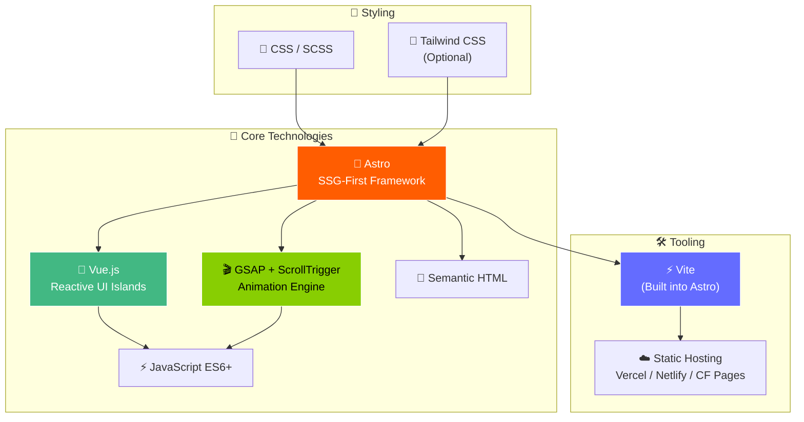
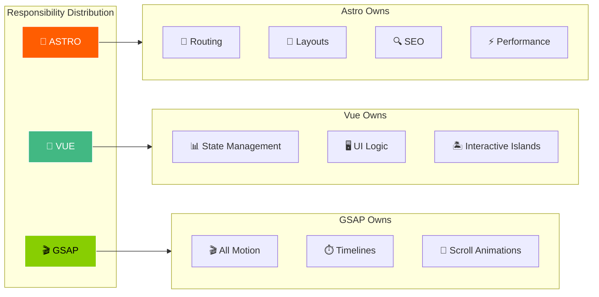
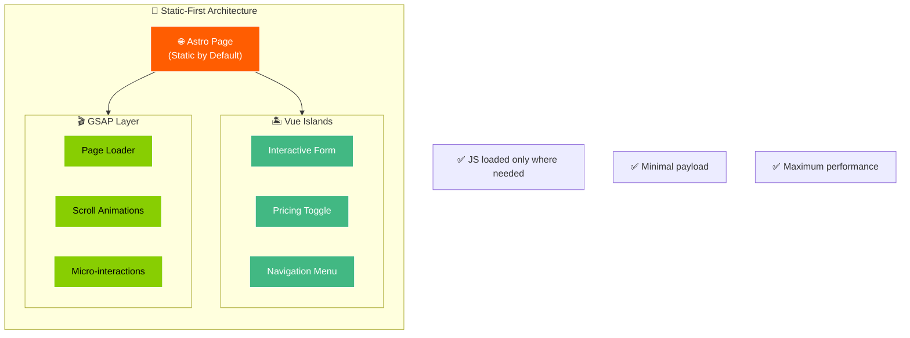
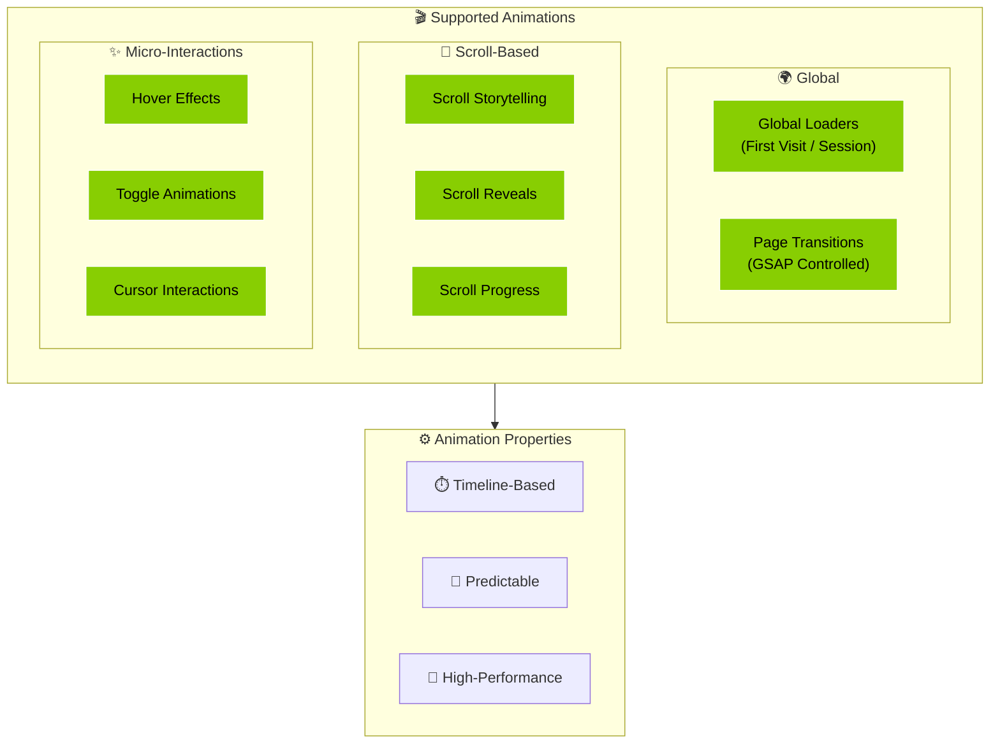
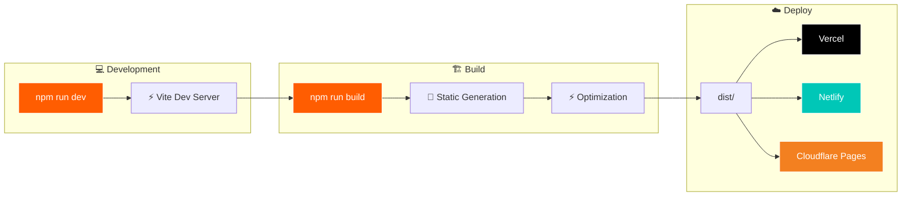
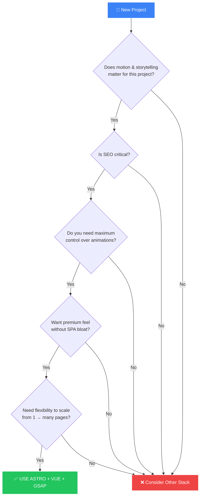
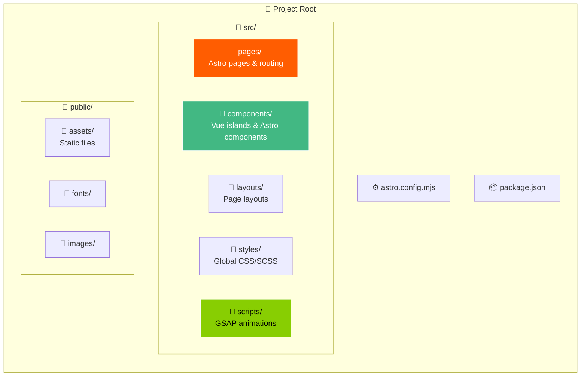

# 🟦 STACK 01 — ASTRO + VUE + GSAP

> **Preferred Stack for ORIGIN & Most Agency Websites**

## 🎯 Purpose

Use this stack to build:
- High-performance landing pages
- Multi-page marketing websites
- Awwwards-level motion & reactivity
- SEO-first agency sites
- Websites with light-to-medium interactivity

---

## 🧱 Technology Stack Overview

---

## 🧠 Architecture Philosophy

---

## 🏗️ Page Architecture

---

## 🎬 Animation System

---

## 🚀 Build & Deploy Flow

---

## ✅ Decision Flowchart: When to Use This Stack

---

## 📋 Project Structure

---

## 🏆 Why This Stack Wins Awards

| Advantage | Description |
|-----------|-------------|
| **Best Performance-to-Power Ratio** | Maximum capability with minimal overhead |
| **Minimal JS Payload** | Only load JavaScript where needed |
| **No Framework Fight** | GSAP works naturally, no lifecycle conflicts |
| **Extremely SEO-Friendly** | Static HTML by default |
| **Easy to Scale** | From 1 page to many pages effortlessly |
| **Ideal for Marketing Sites** | Perfect for award-level agency work |

---

## 🎯 Ideal Use Cases

- ✅ Motion & storytelling matter
- ✅ SEO is critical
- ✅ Maximum animation control needed
- ✅ Premium feel required
- ✅ Flexibility without SPA bloat
