# 🟩 STACK 02 — NUXT + GSAP

> **Full Reactive / App-Like Creative Websites**

## 🎯 Purpose

Use this stack to build:
- Highly interactive websites
- App-like creative experiences
- Heavy page transitions
- Complex reactive logic
- CMS-driven or multilingual sites

---

## 🧱 Technology Stack Overview

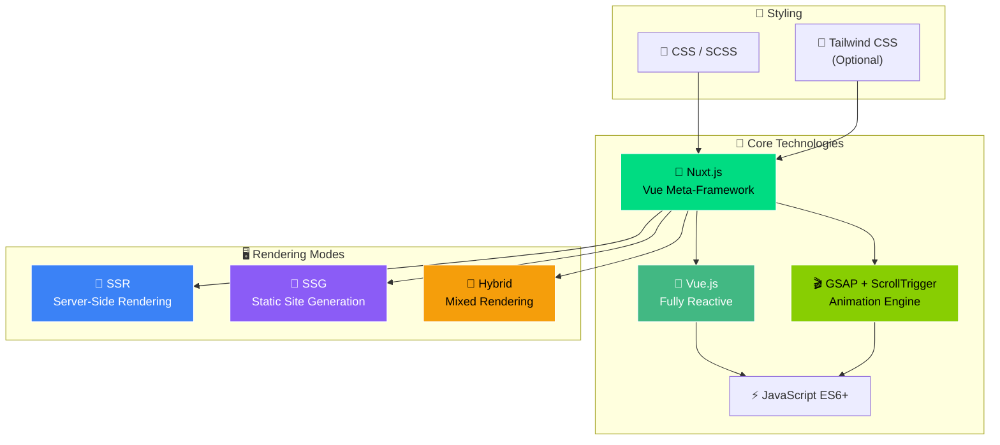

---

## 🧠 Architecture Philosophy

```mermaid
flowchart LR
    subgraph Philosophy["🧠 Core Philosophy"]
        direction TB
        R1["Everything is Reactive<br/>by Default"]
        R2["Navigation = SPA Behavior"]
        R3["Page Transitions Built-in"]
        R4["More JS = More Control"]
    end

    subgraph Integration["⚠️ GSAP Integration"]
        I1["Must integrate with<br/>Vue Lifecycle"]
        I2["Careful cleanup of<br/>GSAP instances required"]
        I3["ScrollTrigger refresh<br/>management needed"]
    end

    Philosophy --> Integration

    style R1 fill:#00DC82,stroke:#fff,color:#000
    style R2 fill:#00DC82,stroke:#fff,color:#000
    style R3 fill:#00DC82,stroke:#fff,color:#000
    style R4 fill:#00DC82,stroke:#fff,color:#000
    style I1 fill:#f59e0b,stroke:#fff,color:#000
    style I2 fill:#f59e0b,stroke:#fff,color:#000
    style I3 fill:#f59e0b,stroke:#fff,color:#000
```

---

## 🏗️ SPA Architecture

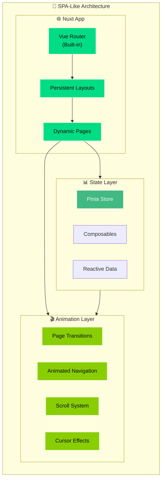

---

## 🎬 Animation System

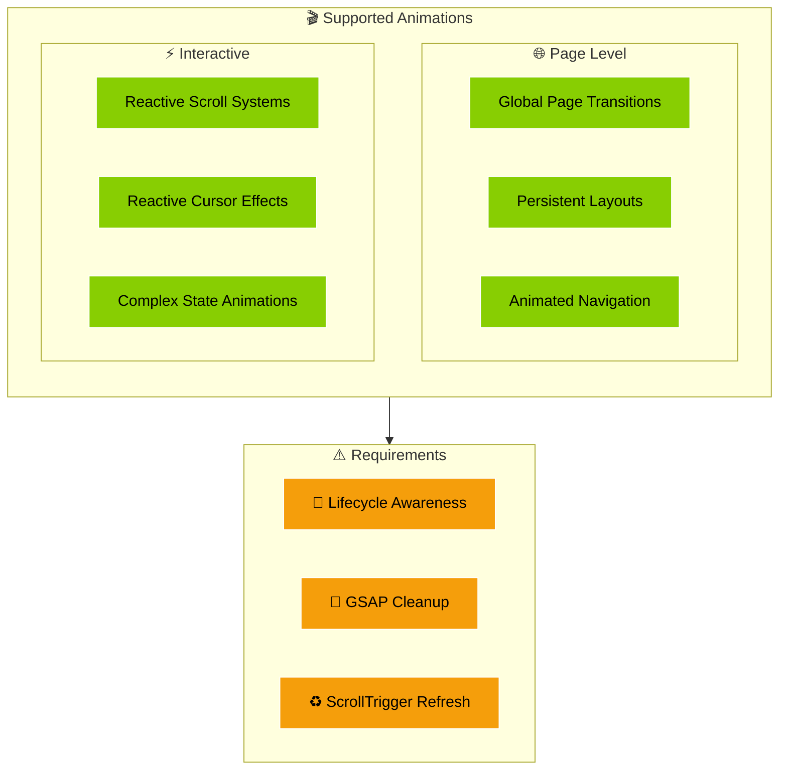

---

## 🔄 Vue Lifecycle + GSAP Integration

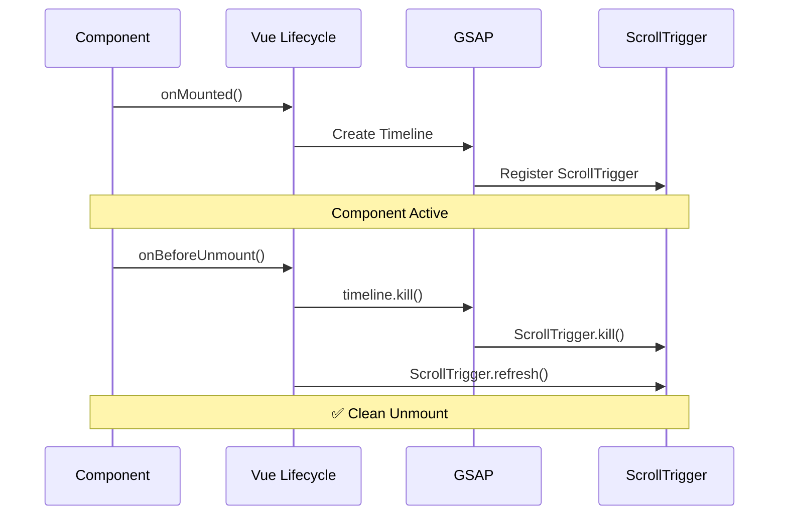

---

## 🖥️ Rendering Modes

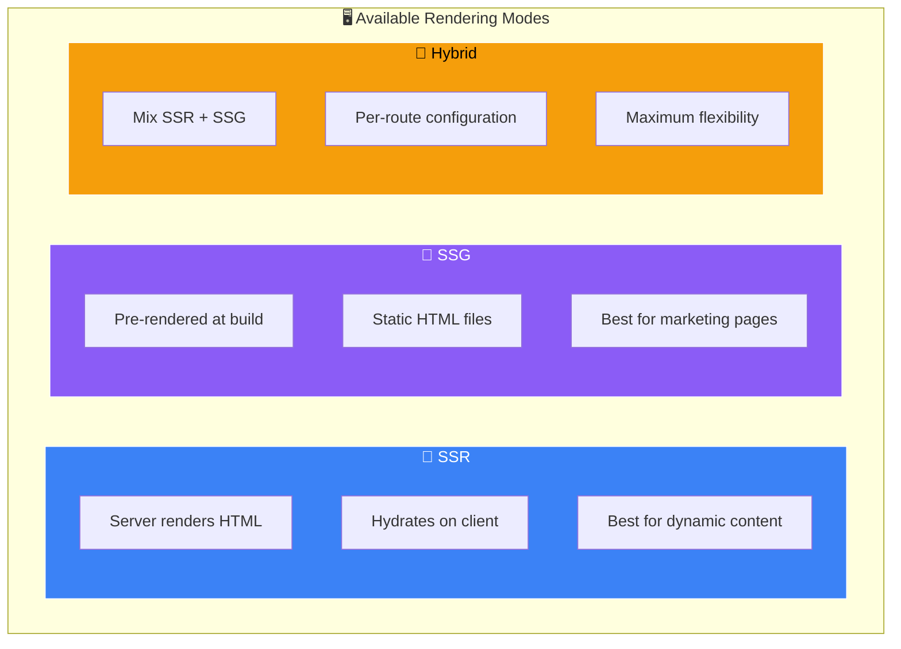

---

## ⚖️ Tradeoffs Analysis

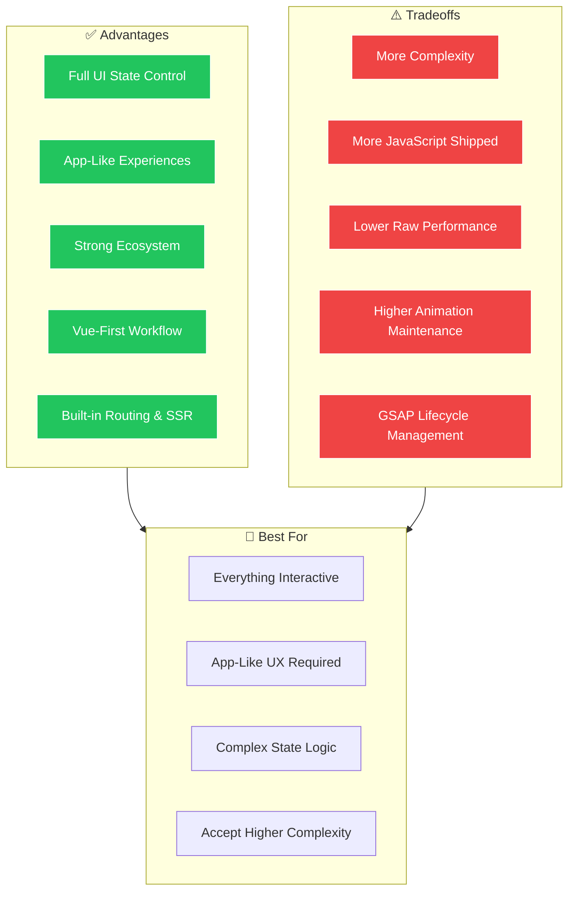

---

## ✅ Decision Flowchart: When to Use This Stack

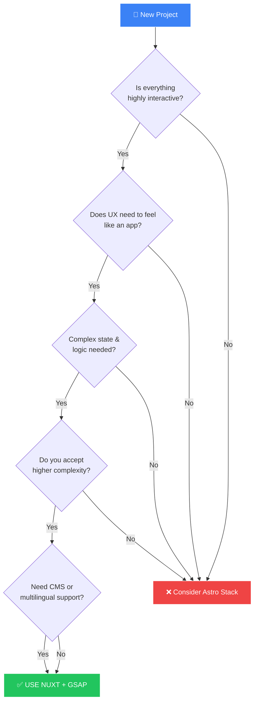

---

## 📋 Project Structure

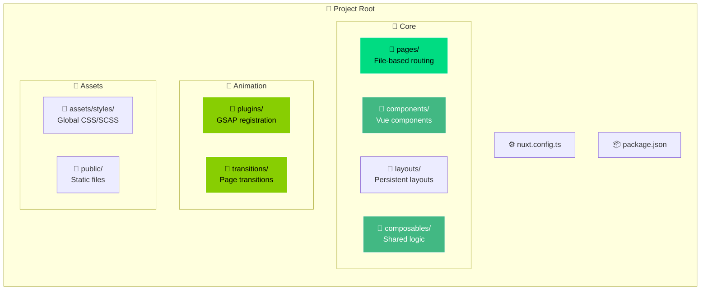

---

## 🔧 GSAP Plugin Setup

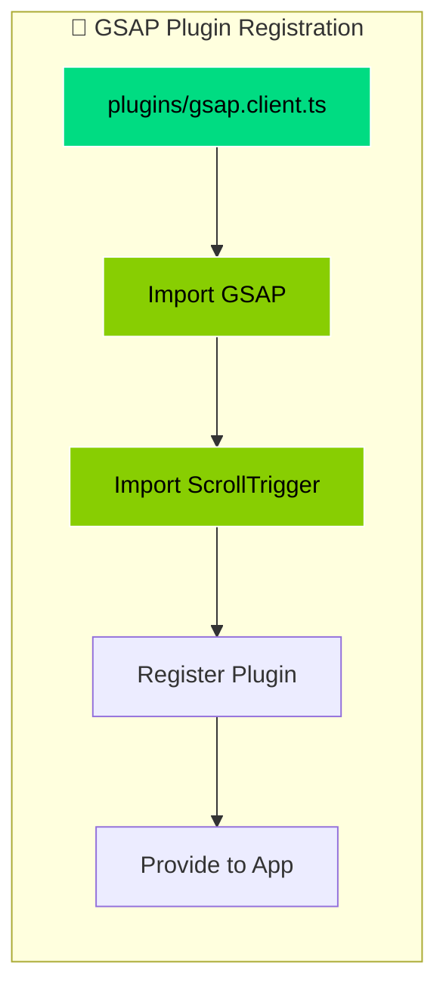

---

## 🏆 Comparison: When to Choose Each Stack

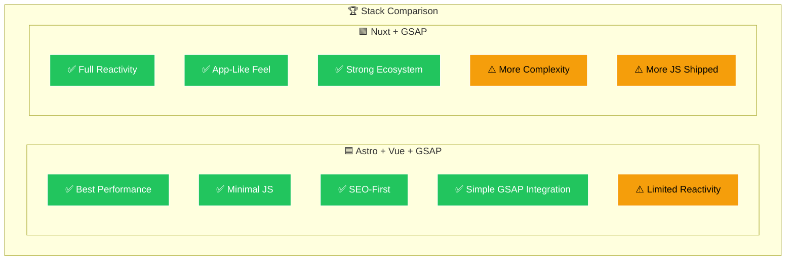

---

## 🎯 Ideal Use Cases

- ✅ Everything is interactive
- ✅ UX feels like an app
- ✅ Complex state & logic needed
- ✅ CMS-driven content
- ✅ Multilingual requirements
- ✅ Accept higher complexity for more power
